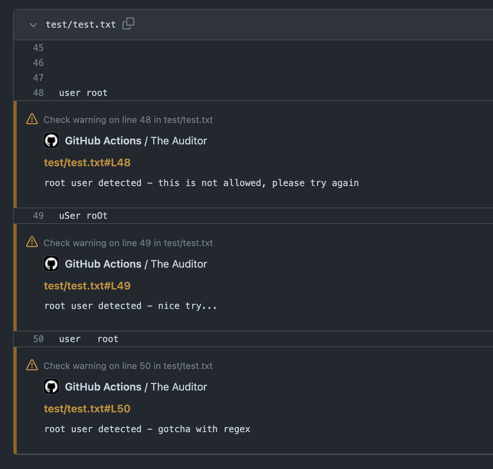

# auditor-action-core ⚙️

 

> The Action you are probably looking for is [auditor-action](https://github.com/GrantBirki/auditor-action)

The core of the auditor-action. This is the package that does the heavy lifting. It is not meant to be used directly, but rather as a dependency of the auditor-action

## About 💡

This package is the core of the auditor-action. It works by doing the following:

1. Loads the `auditor.yml` configuration file
2. Loads the Git Diff in JSON format from the [git-diff-action](https://github.com/GrantBirki/git-diff-action)
3. Uses the config file to process the JSON git diff and looks for violations
4. Reports the violations as a comment on the PR depending on what environment variables are set

## Inputs 📥

| Name | Required? | Default | Description |
| --- | --- | --- | --- |
| `github_token` | yes | `${{ github.token }}` | The GitHub token to use for the Action - included for you by default! |
| `annotate_pr` | no | `"true"` | Whether or not to annotate the PR with the violations |
| `github_base_url` | yes | `https://github.com` | The base URL for the GitHub instance you are using |
| `json_diff_path` | yes | `diff.json` | The path to the JSON diff file to load |
| `config_path` | yes | `config/auditor.yml` | The path to the `auditor.yml` configuration file |
| `annotate_name` | yes | `The Auditor` | The name of the annotation to name to use |
| `annotate_title` | yes | `The Auditor has detected findings in your pull request` | The title of the annotation to use |
| `annotate_summary` | yes | `Please review the findings and make any necessary changes` | The summary of the annotation to use |
| `annotate_status` | yes | `completed` | The status of the annotation to use |
| `write_results_path` | no | `""` | The path to write the markdown results to (for custom reporting) - Leave unset to disable writing results to a file |

## Outputs 📤

| Name | Description |
| --- | --- |
| `passed` | Whether or not the audit passed - 'true' or 'false' |
| `violation_count` | The number of violations found |
| `requested_reviewers` | The list of requested reviewers (if any) |

## Configuration 📝

To view the full list of configuration options, see the [auditor-action](https://github.com/GrantBirki/auditor-action#configuration-)'s section on configuration

## Annotations ✅

By default, this Action will leave annotations on pull requests with any findings. You can disable this by setting the `annotate_pr` input to `false`. If you do not want to use the default annotation settings, you can override them with the `annotate_name`, `annotate_title`, `annotate_summary`, and `annotate_status` inputs.

### Example Annotation 📸

## Permissions 🛡

️If you are using the `annotate_pr` option, you will need to provide the `GITHUB_TOKEN` with the `checks: write` permission. This is because the `GITHUB_TOKEN` provided by GitHub Actions does not have the necessary permissions to annotate PRs. If you are not using the `annotate_pr` option, you do not need to worry about this.

You will likely also need:

- `pull-requests: write`
- `contents: read`
- `actions: read`
